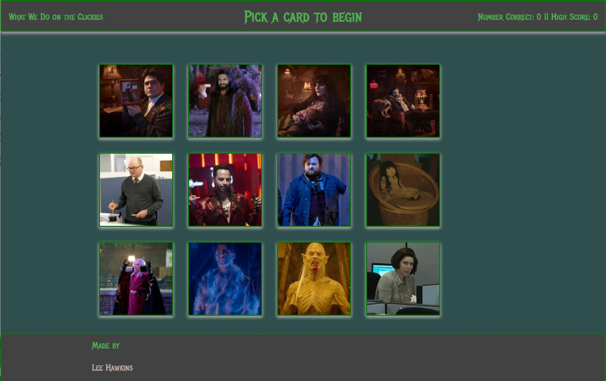

# What We Do on the Clickies

What We Do on the Clickies is a React web application hosted on Heroku.
The goal is to click on as many cards as possible without clicking on the same card twice within the same round.
Sounds easy enough, but the cards shuffle every time you choose a card.  Each card chosen without being a duplicate adds a point to your total.  The game is over if you choose the same card twice in the same round.  If you get through all twelve cards without choosing any card twice the round is over and you begin again with the points from the previous round carried over. 

## [Play on Heroku](https://whatwedoontheclickies.herokuapp.com/)

### Built with

* Node.js - runtime environment
* Express.js - server framework for Node.js
* React - user interface components and state control
* Materialize.CSS - styling and page layout

